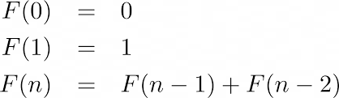

Finding time complexities of recurrence relations using Akra Bazzi thoerm.

There are two types of Recurrence relations:
1. Linear
2. Divide & Conquer 

Linear recurrence relation example (fibonacci):

Divide and conquer recurrence relation example (merge sort):
                 
    [T(n) = 2T(n/2) + (n-1)]
Here, 2T(n/2) is dividing into two sub-arrays and (n-1) is for merging.

The general form of divide and conquer recurrence relation is:
    

Now, we have Akra-Bazzi thoerm:

here, P is found by:

